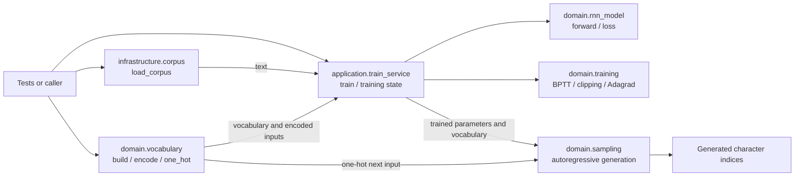
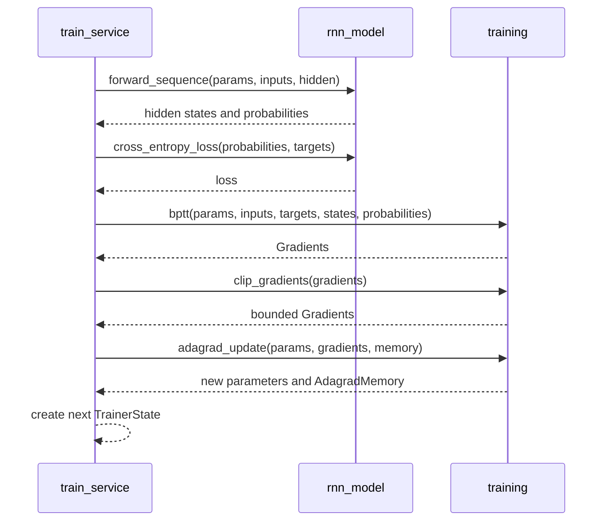
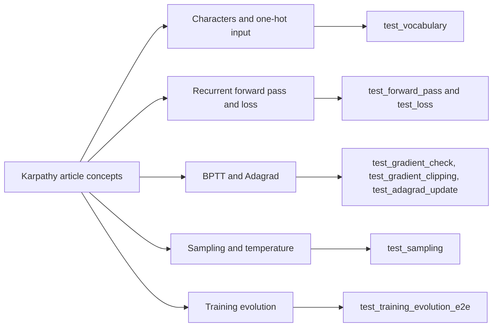

# Code Structure and Quality Report

## Scope

This report describes the repository as a small, test-driven Python/NumPy
companion to Andrej Karpathy's article, not as a copy of the original
`karpathy/char-rnn` codebase. It reimplements the central character-level RNN
training and sampling ideas with a functional domain layer and an application
training loop. The implementation is intentionally small and uses a short,
original corpus for fast tests.

References:

- [The Unreasonable Effectiveness of Recurrent Neural Networks](https://karpathy.github.io/2015/05/21/rnn-effectiveness/)
- [karpathy/char-rnn on GitHub](https://github.com/karpathy/char-rnn)
- Project rationale and article-to-test map: [README](../README.md)

The connection is conceptual and test-driven: the source docstrings and tests
point to ideas from the article, including one-hot character inputs, recurrent
state, BPTT, Adagrad, temperature, and autoregressive sampling. The code uses
NumPy and this repository's own module layout; it does not import or run the
GitHub repository. Its default training text is a small repeated sentence,
not the large corpus used in the article's experiments.

## Architecture

The caller (including the end-to-end tests) loads text and builds a vocabulary,
then passes both to the application service. Infrastructure does not call the
domain or application layer; it only supplies text.



One training batch follows this sequence. `TrainerState` is replaced with a
new state after each batch; domain operations return new parameter, gradient,
and optimizer-memory values rather than mutating their inputs.



## Karpathy Concepts and Tests

| Article idea | Implementation | Focused test |
|---|---|---|
| Character-level vocabulary and 1-of-k inputs | [vocabulary.py](../domain/vocabulary.py) | [test_vocabulary.py](../tests/test_vocabulary.py) |
| Recurrent hidden state and RNN forward computation | [rnn_model.py](../domain/rnn_model.py) | [test_forward_pass.py](../tests/test_forward_pass.py) |
| Softmax classifier and sequence cross-entropy | [rnn_model.py](../domain/rnn_model.py) | [test_loss.py](../tests/test_loss.py) |
| Backpropagation through time | [training.py](../domain/training.py) | [test_gradient_check.py](../tests/test_gradient_check.py) |
| Gradient clipping from the reference implementation | [training.py](../domain/training.py) | [test_gradient_clipping.py](../tests/test_gradient_clipping.py) |
| Per-parameter adaptive learning rates (Adagrad) | [training.py](../domain/training.py) | [test_adagrad_update.py](../tests/test_adagrad_update.py) |
| Sampling the next character and feeding it back; temperature | [sampling.py](../domain/sampling.py) | [test_sampling.py](../tests/test_sampling.py) |
| Loss improvement and recognizable samples after training | [train_service.py](../application/train_service.py) | [test_training_evolution_e2e.py](../tests/test_training_evolution_e2e.py) |



To run one topic's tests, for example the forward pass:

```bash
./.venv/bin/python -m pytest tests/test_forward_pass.py -v
```

To run the full suite:

```bash
./.venv/bin/python -m pytest
```

## CRAP Analysis

[crap.py](crap.py) combines Radon's cyclomatic complexity with line coverage
from Coverage.py. For complexity $C$ and coverage fraction $v$, it computes:

$$
\operatorname{CRAP} = C^2(1-v)^3 + C
$$

The configured failure threshold is `5.0`; the analyzer currently measures
`domain/` and `application/`, not `infrastructure/`, the tests, or the quality
tools themselves. Function coverage is estimated from executed and missing
lines inside each Radon entry's source-line span, so treat it as a useful
signal rather than a correctness proof.

Latest run: all 30 tests passed under coverage. The analyzer reported 32
Radon entries; the highest CRAP score was `_run_epoch` at complexity 3,
86% line coverage, and score 3.03. All reported entries were below the
`5.0` threshold. The next-highest complexity entries had complexity 2,
100% line coverage, and score 2.00; complexity-1 entries scored 1.00.

`_run_epoch` is the best candidate for the next focused test. Its lower
coverage suggests adding cases for the optional `on_snapshot` callback and
batch/epoch edge conditions, then rerunning the report to see whether the
uncovered lines are behaviorally important. Do not add tests just to raise a
percentage; target meaningful behavior.

Run the analysis after collecting fresh coverage data:

```bash
./.venv/bin/python -m coverage run --branch -m pytest
./.venv/bin/python quality/crap.py
```

The script creates `coverage.json` from the coverage data when needed. It
invokes Radon and Coverage.py through the active Python interpreter, so their
executables do not also need to be on the shell's `PATH`.