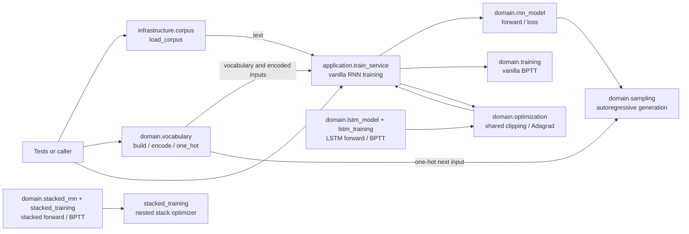

# Code Structure and Quality Report

## Scope

This report describes the repository as a small, test-driven Python/NumPy
companion to Andrej Karpathy's article, not as a copy of the original
`karpathy/char-rnn` codebase. It reimplements the central character-level RNN
training and sampling ideas with a functional domain layer and an application
training loop. The implementation is intentionally small and uses a short,
original corpus for fast tests.

References:

- [The Unreasonable Effectiveness of Recurrent Neural Networks](https://karpathy.github.io/2015/05/21/rnn-effectiveness/)
- [karpathy/char-rnn on GitHub](https://github.com/karpathy/char-rnn)
- Project rationale and article-to-test map: [README](../README.md)

The connection is conceptual and test-driven: the source docstrings and tests
point to ideas from the article, including one-hot character inputs, recurrent
state, BPTT, Adagrad, temperature, and autoregressive sampling. The code uses
NumPy and this repository's own module layout; it does not import or run the
GitHub repository. Its default training text is a small repeated sentence,
not the large corpus used in the article's experiments.

## Architecture

The caller loads text and builds a vocabulary before passing them to the
application service. Infrastructure supplies corpus text and does not depend
on the domain or application layers. The application training service
currently trains the vanilla RNN; the LSTM and stacked RNN implementations
are domain-level forward and gradient APIs with focused correctness tests.



One vanilla-RNN training batch follows this sequence. `TrainerState` is
replaced after each batch; domain operations return new values rather than
mutating their inputs. `backpropagate_through_time` also returns the gradient with respect to the
initial hidden state, which ordinary truncated training ignores but the
vanishing-gradient test measures.

```mermaid
sequenceDiagram
    participant App as train_service
    participant Model as rnn_model
    participant Learn as training
    participant Opt as optimization
    App->>Model: forward_sequence(params, inputs, hidden)
    Model-->>App: hidden states and probabilities
    App->>Model: cross_entropy_loss(probabilities, targets)
    Model-->>App: loss
    App->>Learn: backpropagate_through_time(params, inputs, targets, states, probabilities)
    Learn-->>App: Gradients and initial-state gradient
    App->>Opt: clip_gradients(gradients)
    Opt-->>App: bounded Gradients
    App->>Opt: adagrad_update(params, gradients, memory)
    Opt-->>App: new parameters and AdagradMemory
    App-->>App: create next TrainerState
```

## Concepts and Tests

| Concept | Implementation | Focused test |
|---|---|---|
| Character vocabulary and one-hot inputs | [vocabulary.py](../domain/vocabulary.py) | [test_vocabulary.py](../tests/test_vocabulary.py) |
| Vanilla RNN forward pass and cross-entropy | [rnn_model.py](../domain/rnn_model.py) | [test_forward_pass.py](../tests/test_forward_pass.py), [test_loss.py](../tests/test_loss.py) |
| Vanilla BPTT, numerical gradients, and initial-state gradient | [training.py](../domain/training.py) | [test_gradient_check.py](../tests/test_gradient_check.py) |
| Shared clipping, zeroed optimizer memory, and Adagrad | [optimization.py](../domain/optimization.py) | [test_optimization.py](../tests/test_optimization.py), [test_gradient_clipping.py](../tests/test_gradient_clipping.py), [test_adagrad_update.py](../tests/test_adagrad_update.py) |
| LSTM gates, cell state, and forward pass | [lstm_model.py](../domain/lstm_model.py) | [test_lstm_forward_pass.py](../tests/test_lstm_forward_pass.py) |
| LSTM BPTT and numerical gradients | [lstm_training.py](../domain/lstm_training.py) | [test_lstm_gradient_check.py](../tests/test_lstm_gradient_check.py) |
| Long-range gradient retention in an LSTM vs. vanilla RNN | [lstm_training.py](../domain/lstm_training.py), [training.py](../domain/training.py) | [test_vanishing_gradient_comparison.py](../tests/test_vanishing_gradient_comparison.py) |
| Layer chaining in a stacked RNN | [stacked_rnn.py](../domain/stacked_rnn.py) | [test_stacked_rnn_forward_pass.py](../tests/test_stacked_rnn_forward_pass.py) |
| Gradients through stacked layers and time | [stacked_training.py](../domain/stacked_training.py) | [test_stacked_rnn_gradient_check.py](../tests/test_stacked_rnn_gradient_check.py) |
| Clipping and Adagrad for nested stacked parameters | [stacked_training.py](../domain/stacked_training.py) | [test_stacked_rnn_optimizer.py](../tests/test_stacked_rnn_optimizer.py) |
| Autoregressive sampling and temperature | [sampling.py](../domain/sampling.py) | [test_sampling.py](../tests/test_sampling.py) |
| Training loss improvement and generated samples | [train_service.py](../application/train_service.py) | [test_training_evolution_e2e.py](../tests/test_training_evolution_e2e.py) |

Run a focused test, for example the LSTM gradient check:

```bash
./.venv/bin/python -m pytest tests/test_lstm_gradient_check.py -v
```

Run the full suite:

```bash
./.venv/bin/python -m pytest
```

## CRAP Analysis

[crap.py](crap.py) combines Radon's cyclomatic complexity with line coverage
from Coverage.py. For complexity $C$ and coverage fraction $v$, it computes:

$$
\operatorname{CRAP} = C^2(1-v)^3 + C
$$

The configured failure threshold is `5.0`; the analyzer measures `domain/`,
`application/`, and `tests/`, not `infrastructure/` or the quality tools
themselves. Function coverage is estimated from executed and missing lines
inside each Radon entry's source-line span, so treat it as a useful signal
rather than a correctness proof.

Latest run: all 135 tests passed under branch coverage. Every measured
function is below the `5.0` threshold. The highest CRAP score is `4.00`
(complexity 4 with 100% estimated line coverage); several domain and test
functions tie at this score.

The LSTM and stacked RNN have forward and gradient-check coverage, but are not
wired into the application training loop; see the README's scope notes. Add
tests for meaningful behavior rather than coverage percentage alone.

Run the analysis after collecting fresh coverage data:

```bash
./.venv/bin/python run_qa.py

# Or run the steps separately:
./.venv/bin/python -m coverage run --branch -m pytest
./.venv/bin/python -m coverage json -o coverage.json
./.venv/bin/python quality/crap.py
```

The script creates `coverage.json` from the coverage data when needed. It
invokes Radon and Coverage.py through the active Python interpreter, so their
executables do not also need to be on the shell's `PATH`.